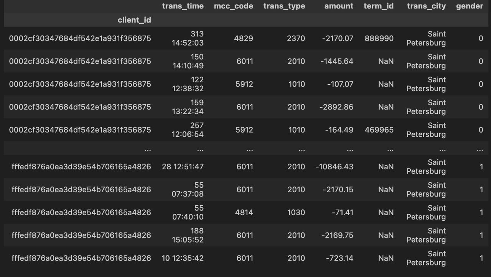
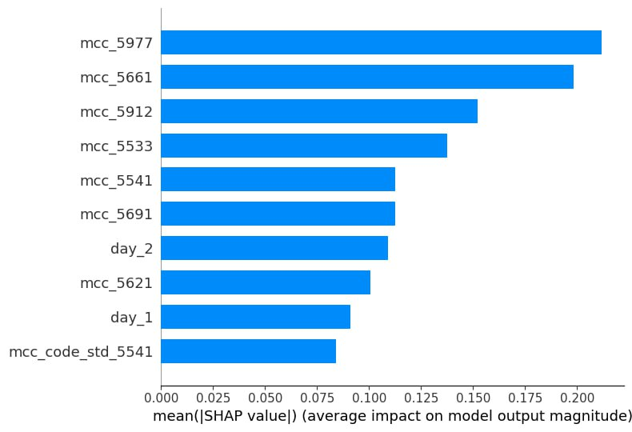
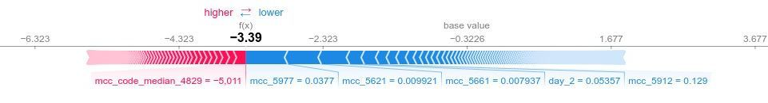
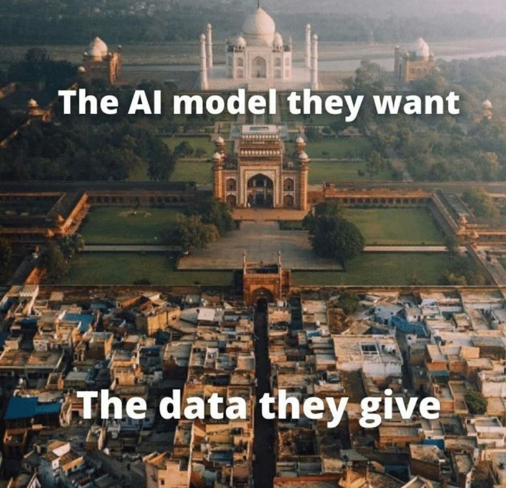

# HSE-Sber-ML-Hack - HACKATHON

"Is it true that our bank transactions also define us in some sense? Is it correct that our purchases can reveal a lot about us? Let's see if machine learning can answer this question!"

## 🦸‍♂️ Team
- [Solomon](https://github.com/veidlink)
- [Mikhail](https://github.com/Tehnorobot)
- [Vlad](https://github.com/vladik-pwnz)
- [Egor](https://github.com/REDISKA3000)

## 🎯 Task
Identifying client gender based on their transaction history 

## 📝 Workflow
Initially, every transaction is described by only 8 features.

- **client_id** - id of client that completed transaction
- **trans_time** - day from some starting day and time of transaction completion)
- **mcc_code** - merchant category code
- **trans_type** - type of transaction
- **amount** - amount of money that the cilent spent or received
- **term_id** - id of terminal
- **trans_city** - city, where the transaction was completed
- **gender** - our traget feature



We performed feature engineering. This involved grouping each client's data by their client ID and other features (except terminal ID and transaction city). We also applied various discriptive statistics to get a detailed profile of each customer by generating more features. For a more comprehensive understanding, feel free to explore the 'transformation.py' file.

Obtained new datasets 'new_train_big.csv' and 'new_test_big.csv', we experimented with diffrenent ML models. Using Optuna, we optimized hyperparameters for several gradient boosting algorithms like CatBoost, XGBoost, and LightGBM. Once we got our initial results, we focused on selecting the most relevant features. We used the Shap package to understand how important each feature was to our model. This package calculates a value called the Shapley value for each feature, indicating its average importance in the model.



It's noteworthy that this dataframe contains over 2000 features and is quite sparse as well. Many columns have a minimal impact on the prediction. We set 0.003 as the threshold for Shap values and dropped insignificant features, finally reducing the number to only 310.

This chart lets us make reliable guesses about how different features influenced our model's learning process. It appears that Merchant Category Codes (where transactions occur) are particularly useful for determining a client's gender.

Women are more likely do shoppinng in beauty stores, shoes stores, pharmacies and clothing stores. Whereas men are more likely to spend money on car service and car spare parts.



Using Shap analysis again, we were able to confirm our hypothesis and determine that class 0 represents women and class 1 represents men. The plot clearly shows that features related to women push the decision boundary towards the left, to class 0, reinforcing our belief that class 0 indeed signifies women.

Additionally, it's worth mentioning that we also experimented with building an Fully-connected Neural Network (FCNN). You can find the details of its simple architecture in our 'models.py' file. Despite not being complex, this model achieved a respectable ROC-AUC score of 0.86.

Our best solution achieved a ROC-AUC of 0.8872, using a CatBoostClassifier. The model, trained on a huge dataset with 2000+ features and tuned to specific parameters for optimal performance, was then fitted on smaller data with 310 features, which blossomed into the finest result.

## ⚙️ Parameters 
```params = {'depth': 6, 'learning_rate': 0.1, 'iterations': 500, 'l2_leaf_reg': 7, 'min_data_in_leaf': 1, 'loss_function': 'Logloss', 'eval_metric': 'AUC'}```

1. **depth**: Determines the maximum depth of the trees in the model.
2. **learning_rate**: Controls the rate at which the model learns during training.
3. **iterations**: Specifies the number of trees to build in the model.
4. **l2_leaf_reg**: Adds L2 regularization to reduce overfitting.
5. **min_data_in_leaf**: Sets the minimum amount of data required in each leaf node.
6. **loss_function ('Logloss')**: Used for binary classification tasks to optimize the model.
7. **eval_metric ('AUC')**: Measures the model's performance for binary classification.


